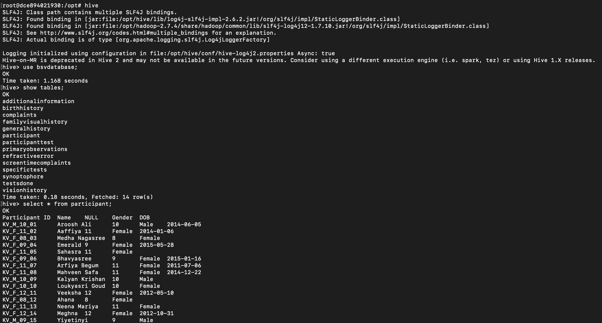

# Hadoop Hive

A Hadoop-Hive data warehouse pipeline for storing and querying multiple types of data, including structured data (Excel/CSV) and unstructured files (videos/images), using SQL and Python.

> My VPS Cred: 93.127.166.113
## Example Output
### Hadoop

### Hive

## Data Preprocessing

* Change the sheet names to all lowercase and without spaces in the sheet names for storing in correct databases.
* place the excel sheet inside the `data` folder with name `data.xlsx`
* Run `xlsx_to_csv.py` to convert xlsx to csv file.
* csv files generates with the sheet names. Verify the correctness of the sheets.

## For storing Excel sheet data and Videos

* chmod +x data/run_hive.sh
* docker compose up
* docker exec -it hive-server /bin/bash
* cd ../data
* ./run_hive.sh
* hive
* Normal SQL Operations.

## Installing Python Hive

`pip install 'pyhive[hive_pure_sasl]'`

* Then Run `hive_phython.py` to get data stored in hadoop using python.

**Reference:** https://hshirodkar.medium.com/apache-hive-on-docker-4d7280ac6f8e

* To View files in hadoop: hdfs dfs -ls /user/hive/warehouse/btpproject.db
